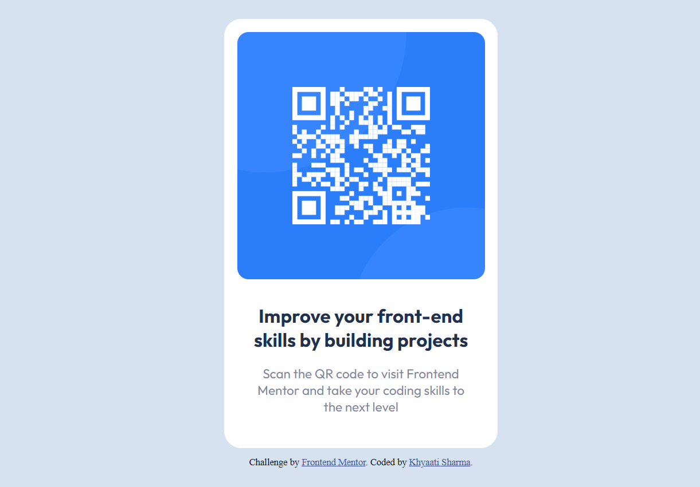
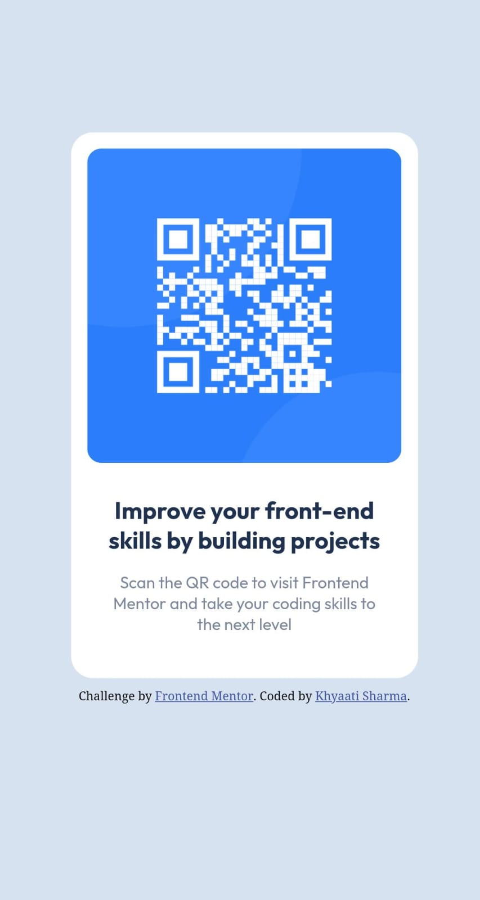

# QR code component solution

This is a solution to the [QR code component challenge on Frontend Mentor](https://www.frontendmentor.io/challenges/qr-code-component-iux_sIO_H). Frontend Mentor challenges help you improve your coding skills by building realistic projects. 

## Table of contents
- [Overview](#overview)
  - [Screenshot](#screenshot)
  - [Links](#links)
- [My process](#my-process)
  - [Built with](#built-with)
  - [What I learned](#what-i-learned)
  - [Continued development](#continued-development)
  - [Useful resources](#useful-resources)
- [Author](#author)
- [Acknowledgments](#acknowledgments)

## Overview

### Screenshot
desktop version:

mobile version:

### Links
- Solution URL:(https://github.com/nedjemcaven/qr-code-component)

## My process

### Built with
- Semantic HTML5 markup
- CSS custom properties
- Flexbox tools

### What I learned
I revised the workflow of building responsive website using HTML5 and CSS. Helped me recall the usage of basic CSS properties like border-radius and padding, and reinforce my knowledge. 

### Continued development
I would love to continue focusing on more CSS frameworks like flexbox and grid for better positioning and enhancing responsiveness. 
Use this section to outline areas that you want to continue focusing on in future projects. These could be concepts you're still not completely comfortable with or techniques you found useful that you want to refine and perfect.

### Useful resources
- Resource 1(https://www.smashingmagazine.com/2020/09/figma-developers-guide/) & (https://www.learnwithjason.dev/introduction-to-figma-for-developers) - This is an amazing article along with a youtube video resource which helped me understand Figma a lot better. I'd recommend it to developers beginning to understand Figma design tools and interface.

## Author
- Name - [Khyaati Sharma]
- Frontend Mentor Account- [@nedjemcaven](https://www.frontendmentor.io/profile/nedjemcaven)

## Acknowledgments
Glad to have tried out developing this tiny qr code scanner component!  
